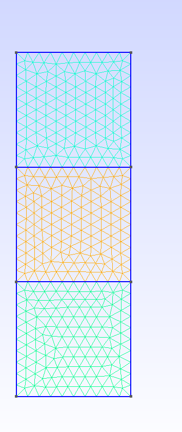
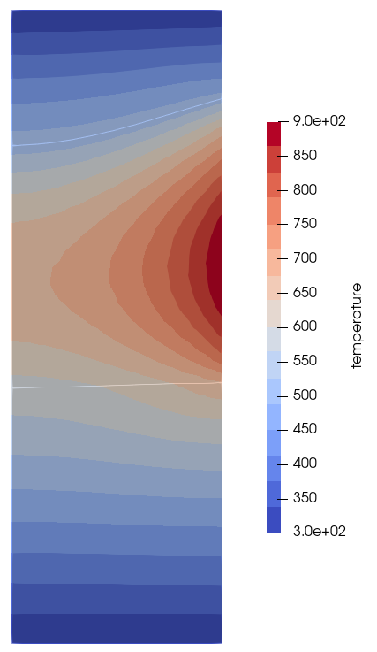
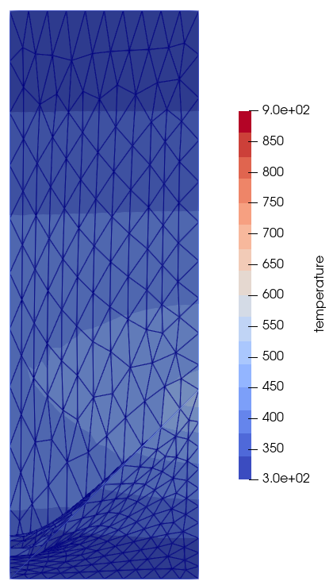

# elmer-double-phasechange

Testing of Elmer simulations with multiple phase boundaries.

The project is developed and maintained by the [**Model experiments group**](https://www.ikz-berlin.de/en/research/materials-science/section-fundamental-description#c486) at the Leibniz Institute for Crystal Growth (IKZ).

### Referencing
If you use this code in your research, please cite our article:

> TODO

## Setup description

The geometry is axisymmetric and consists of three blocks stacked on top of each other (symmetry axis left side).



The top / bottom block are cooled at their ends, the central block is heated at the surface (on the right side). The central block is liquid, top and bottom block are solid. There are two phase boundaries (the boundaries of central to top/bottom block) which shall be moved into the correct position.

A steady-state phase boundary movement is assumed, there is latent heat released at the boundaries. The triple point is not fixed.

The setup shall be used to model (optical) floating zone crystal growth, therefore the naming is as follows:

- Top block: feed
- Central block: melt
- Bottom block: crystal

## Tried implementations

Several attempts have been made to implement this setup. MeshUpdate solver is used for the mesh distortion, but similar results were obtained with the internal mesh movement.

### single-phase-change

Only one of the phase boundaries is moved. This works well:



The setup / result / log files can be found in the directory `single-phase-change`.

### separate-equation

Two phase change solvers, each of them in a separate Elmer equation. It fails when searching for the isothermal:

```
SteadyPhaseChange: --------------------------------------------
SteadyPhaseChange: Using steady algorithm to find the isotherm
SteadyPhaseChange: --------------------------------------------
SteadyPhaseChange: Steady state isoterm formulation
SteadyPhaseChange: Melting point found:                5.0500E+02
Note: The following floating-point exceptions are signalling: IEEE_UNDERFLOW_FLAG
STOP 1
ERROR:: SteadyPhaseChange: Isotherm is empty thus cannot map phase change surface
```

The setup / result / log files can be found in the directory `double_separate-equation`.

### same-equation

Two phase change solvers in the same Elmer equation. It fails (as expected) with a warning in SteadyPhaseChange:

```
WARNING:: SteadyPhaseChange: Isotherm error?
WARNING:: SteadyPhaseChange:  Nodeindexes          27
WARNING:: SteadyPhaseChange:  x:  0.90000000000000002       y:  0.90000000000000002
WARNING:: SteadyPhaseChange:  dxmin:   4.4453931175351014E-002  dymin:   1.7976931348623157E+308
WARNING:: SteadyPhaseChange: Isotherm error?
WARNING:: SteadyPhaseChange:  Nodeindexes          28
(...)
```

And there is no useful result:



The setup / result / log files can be found in the directory `double_same-equation`.

## Acknowledgements

[This project](https://www.researchgate.net/project/NEMOCRYS-Next-Generation-Multiphysical-Models-for-Crystal-Growth-Processes) has received funding from the European Research Council (ERC) under the European Union's Horizon 2020 research and innovation programme (grant agreement No 851768).

